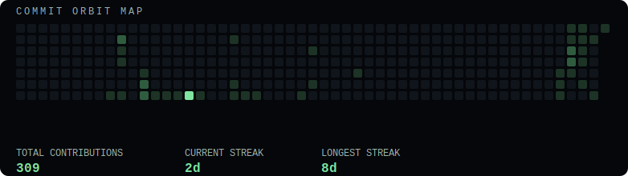

<div align="center">


</div>

<div align="center">


</div>

<br/>

<div align="center">

```
══════════════════════════════════════════════════
             S T A R S H I P   J A N - 0 1
══════════════════════════════════════════════════
```

| FIELD          | VALUE                                                   |
| -------------- | ------------------------------------------------------- |
| Commander      | Jargon                                                  |
| Mission        | Expand Human Intelligence through Engineering + Writing |
| Current Sector | Electronics Engineering — Space Systems Track           |
| Launch Year    | 2026                                                    |
| Mission Time   | T+ ongoing                                              |
| System Status  | 🟢 ONLINE                                               |

```
══════════════════════════════════════════════════
```

</div>

---

## 🛰 Solar System Navigation

<div align="center">

</div>

Every repository is a body in orbit — inner orbits move fastest, outer orbits are the long-burn research.

| Orbit         | Body                    | Repository                           | Class                          |
| ------------- | ----------------------- | ------------------------------------ | ------------------------------ |
| 1 (innermost) | 🖼 I-ASCII              | PNG → ASCII art converter            | Signal Relay                   |
| 2             | 🚌 BUSINA               | Jeepney fleet intelligence PWA       | Flight Computer — active build |
| 3             | 📘 ECE Basics Companion | Interactive ECE review modules       | Knowledge Archive              |
| 4             | 🧠 RelAI                | AI notification & attention platform | AI Core                        |
| 5 (outermost) | 🧫 TRIHALOCEN           | Triple-concentric photobioreactor    | Research Laboratory            |

---

## 📡 Commit Orbit Map

<div align="center">

</div>

<div align="center"><sub>Refreshed automatically every 6 hours by <code>.github/workflows/commit-orbit.yml</code>. Green cells are energy output — the more contributions, the brighter the cell.</sub></div>

---

## 🚀 Current Missions

| Mission              | Status      | Progress       | Objective                             | Destination             |
| -------------------- | ----------- | -------------- | ------------------------------------- | ----------------------- |
| BUSINA               | 🟢 Active   | ████████░░ 80% | Fleet intelligence frontend           | `/BUSINA`               |
| RelAI                | 🟡 Building | ███████░░░ 70% | Unified AI notification layer         | `/RelAI`                |
| TRIHALOCEN           | 🟡 Research | █████░░░░░ 50% | Uniform light-thermal photobioreactor | `/TRIHALOCEN`           |
| ECE Basics Companion | 🟢 Active   | ██████░░░░ 60% | Interactive ECE review modules        | `/ece-basics-companion` |
| I-ASCII              | 🟢 Active   | ████████░░ 80% | PNG-to-ASCII converter, web + desktop | `/I-ASCII`              |

---

## 🧰 Tech Stack

**Languages**


**Frontend**


**Backend**


**Dev Tools & Environment**


---

## ⚙ Engineering Bay (Hardware & EE Tools)


Coursework spans physics, calculus, material science, basic electronics, computer-aided drafting, and circuit theory — benchmarked against Young & Freedman, Boylestad, and Callister.

---

## 🧩 Installed Ship Modules

```
CORE MODULES
────────────────────────────────────
[✓] Navigation
    Roadmaps across math, circuits, and space systems

[✓] Engineering Bay
    Electronics, CAD, ANSYS, Multisim, circuit theory

[✓] AI Core
    RelAI — categorization, dedup, natural-language ops

[✓] Knowledge Archive
    ECE Basics Companion — interactive concept review

[✓] Research Laboratory
    TRIHALOCEN — photobioreactor systems research

[✓] Flight Computer
    BUSINA — fleet intelligence frontend systems

[✓] Communications
    Writing & journalism — long-form, reported, edited

[✓] Open Source Relay
    I-ASCII — image-to-ASCII conversion tool
────────────────────────────────────
```

---

## 🪵 Mission Log

```
2026
✓ Entered Electronics Engineering — Space Systems Track
✓ Built BUSINA frontend — PWA infra, design system overhaul
✓ Built RelAI — AI notification aggregation platform
✓ Started ECE Basics Companion
✓ Launched I-ASCII
✓ Began TRIHALOCEN photobioreactor research
```

---

## 🌌 Galactic Roadmap

```
NEXT SECTORS
────────────────────────
□ Embedded AI
□ Robotics
□ Space Electronics Research
□ NASA / PhilSA Pipeline
□ Startup
────────────────────────
```

---

## 🚀 Ignition

<div align="center">

</div>

---

## 🤖 AI Assistant

<table>
<tr>
<td valign="top" width="15%">

```
   ___
  |o_o|
  |:_/ |
 //   \ \
(|     | )
/'\_   _/`\
\___)=(___/
```

</td>
<td valign="top" width="85%">

```
> INCOMING TRANSMISSION

  Commander, all systems nominal.
  Five active repositories detected in orbit.
  Knowledge archive expanding.
  Recommend continued approach toward
  Space Electronics sector.

  — JAN-OS
```

</td>
</tr>
</table>

---

## 🖥 Terminal

```
C:\JAN-OS> status
ONLINE

C:\JAN-OS> modules
NAVIGATION · ENGINEERING BAY · AI CORE · KNOWLEDGE ARCHIVE
RESEARCH LAB · FLIGHT COMPUTER · COMMS · OPEN SOURCE RELAY

C:\JAN-OS> missions
BUSINA · RelAI · TRIHALOCEN · ECE Basics Companion · I-ASCII

C:\JAN-OS> roadmap
EMBEDDED AI → ROBOTICS → SPACE ELECTRONICS → NASA/PhilSA → STARTUP

C:\JAN-OS> _
```

---

<div align="center">

_"The journey has only begun."_

</div>
