<div align="center">


</div>

<div align="center">


</div>

<br/>

<div align="center">

```
══════════════════════════════════════════════════
             S T A R S H I P   J A N - 0 1
══════════════════════════════════════════════════
```

| FIELD | VALUE |
|---|---|
| Commander | Jargon |
| Mission | Expand Human Intelligence through Engineering + Writing |
| Current Sector | Electronics Engineering — Space Systems Track |
| Launch Year | 2026 |
| Mission Time | T+ ongoing |
| System Status | 🟢 ONLINE |

```
══════════════════════════════════════════════════
```

</div>

---

## 🛰 Solar System Navigation

<div align="center">

</div>

Every repository is a body in orbit around the core. Closer orbits ship faster; outer orbits are long-burn research.

| Body | Repository | Class |
|---|---|---|
| 🚌 BUSINA | Jeepney fleet intelligence PWA | Inner orbit — active build |
| 🧠 RelAI | AI notification & attention platform | Mid orbit — hackathon-forged |
| 🧫 TRIHALOCEN | Triple-concentric photobioreactor | Outer orbit — research |
| 📘 ECE Basics Companion | Interactive ECE review modules | Knowledge Archive |
| 🖼 I-ASCII | PNG → ASCII art converter | Signal Relay |

---

## 📡 Mission Dashboard

<table>
<tr>
<td valign="top" width="55%">

```
MISSION TELEMETRY
──────────────────────────────
Objective         Expand Human Intelligence
Status            ACTIVE
Knowledge Growth  ████████░░  78%
Active Projects   5
Repositories      SYNCED
Current Learning  Circuit Theory · Space Electronics
Long-Term Target  NASA / PhilSA — Space Engineering
──────────────────────────────
```

</td>
<td valign="top" width="45%" align="center">



</td>
</tr>
</table>

---

## 🧩 Installed Ship Modules

```
CORE MODULES
────────────────────────────────────
[✓] Navigation
    Roadmaps across math, circuits, and space systems

[✓] Engineering Bay
    Electronics, CAD, ANSYS, Multisim, circuit theory

[✓] AI Core
    RelAI — categorization, dedup, natural-language ops

[✓] Knowledge Archive
    ECE Basics Companion — interactive concept review

[✓] Research Laboratory
    TRIHALOCEN — photobioreactor systems research

[✓] Flight Computer
    BUSINA — fleet intelligence frontend systems

[✓] Communications
    Writing & journalism — long-form, reported, edited

[✓] Open Source Relay
    I-ASCII — image-to-ASCII conversion tool
────────────────────────────────────
```

---

## 🚀 Current Missions

| Mission | Status | Progress | Objective | Destination |
|---|---|---|---|---|
| BUSINA | 🟢 Active | ████████░░ 80% | Fleet intelligence frontend | `/BUSINA` |
| RelAI | 🟡 Building | ███████░░░ 70% | Unified AI notification layer | `/RelAI` |
| TRIHALOCEN | 🟡 Research | █████░░░░░ 50% | Uniform light-thermal photobioreactor | `/TRIHALOCEN` |
| ECE Basics Companion | 🟢 Active | ██████░░░░ 60% | Interactive ECE review modules | `/ece-basics-companion` |
| I-ASCII | 🟢 Active | ████████░░ 80% | PNG-to-ASCII converter, web + desktop | `/I-ASCII` |

---

## 🪵 Mission Log

```
2026
✓ Entered Electronics Engineering — Space Systems Track
✓ Built BUSINA frontend — PWA infra, design system overhaul
✓ Built RelAI — AI notification aggregation platform
✓ Started ECE Basics Companion
✓ Launched I-ASCII
✓ Began TRIHALOCEN photobioreactor research
```

---

## 🌌 Galactic Roadmap

```
NEXT SECTORS
────────────────────────
□ Embedded AI
□ Robotics
□ Space Electronics Research
□ NASA / PhilSA Pipeline
□ Startup
────────────────────────
```

---

## 🤖 Crew AI

```
> INCOMING TRANSMISSION

  Commander, all systems nominal.
  Five active repositories detected in orbit.
  Knowledge archive expanding.
  Recommend continued approach toward
  Space Electronics sector.

  — JAN-OS
```

---

## 🖥 Terminal

```
C:\JAN-OS> status
ONLINE

C:\JAN-OS> modules
NAVIGATION · ENGINEERING BAY · AI CORE · KNOWLEDGE ARCHIVE
RESEARCH LAB · FLIGHT COMPUTER · COMMS · OPEN SOURCE RELAY

C:\JAN-OS> missions
BUSINA · RelAI · TRIHALOCEN · ECE Basics Companion · I-ASCII

C:\JAN-OS> roadmap
EMBEDDED AI → ROBOTICS → SPACE ELECTRONICS → NASA/PhilSA → STARTUP

C:\JAN-OS> _
```

---

<div align="center">

*"The journey has only begun."*

</div>
